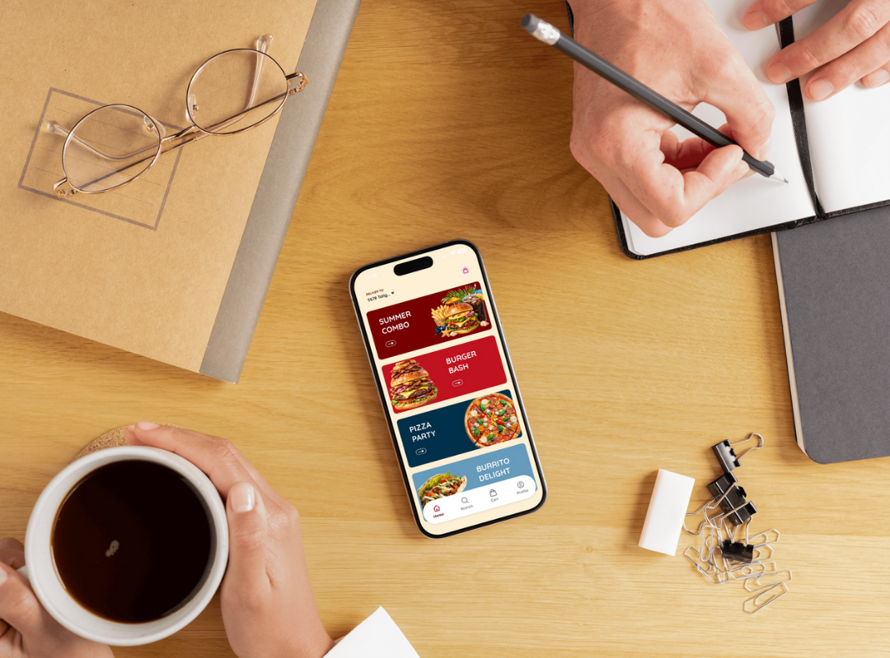

<div align="center">
  <br />
      
    </a>
  <br />
</div>

<h3 align="center">StudyBreak-Bite app</h3>

## Welcome to my app 👋

This app is a mobile food discovery and delivery concept designed to support university students by making campus food access faster and more efficient. It helps students stay focused on their studies by enabling food delivery to specific campus locations, reducing interruptions and unnecessary travel. The app also offers online ordering for pickup, allowing students to skip long lines and save valuable time during busy academic schedules.


## Installation Guide

```bash
git clone https://github.com/RjGutierrezz/StudyBreak-Bite.git

# Then navigate to the file directory
cd StudyBreak-Bite

# Since the app database depend on Appwrite, you would need to create .env in the make directory and add the following. (Please replace the project ID with your appwrite ID)
```bash
EXPO_PUBLIC_APPWRITE_PROJECT_ID=your_ID_from_appwrite
EXPO_PUBLIC_APPWRITE_PROJECT_NAME="StudyBreak-Bite"
EXPO_PUBLIC_APPWRITE_ENDPOINT=https://sfo.cloud.appwrite.io/v1
```
# Type the following to your terminal to give your device permission to run the script file
```bash
chmod 755 run.sh
```


# Now run
```bash
./run.sh
```

# Finally press i
```bash
i
```
## Technologies Used 💻

- React Native
- Typescript
- Javascript
- Expo
- Expo Router
- Tailwind CSS